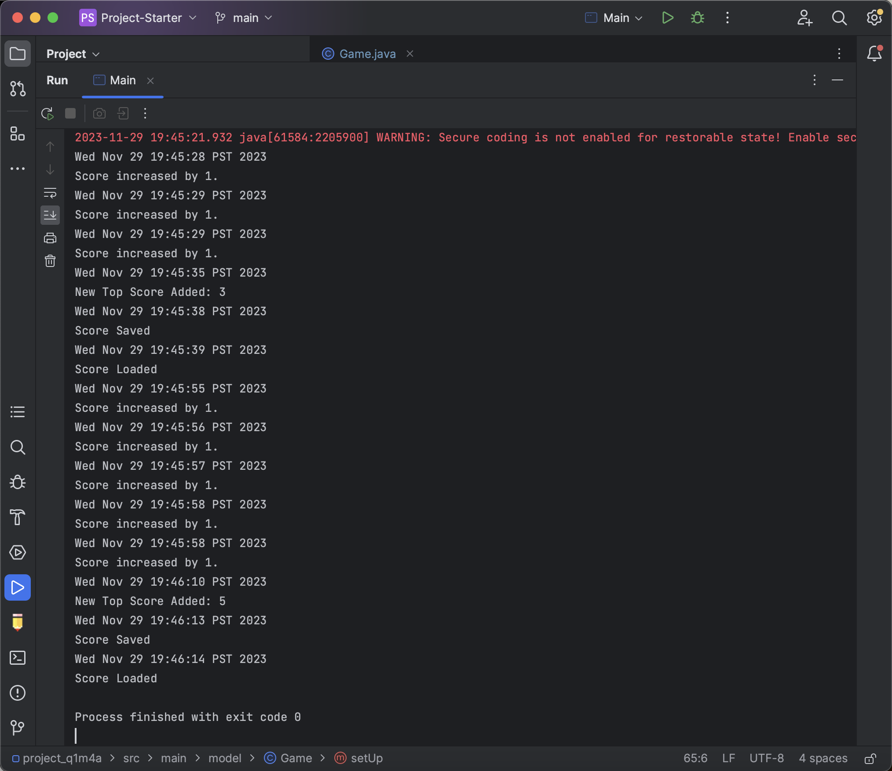
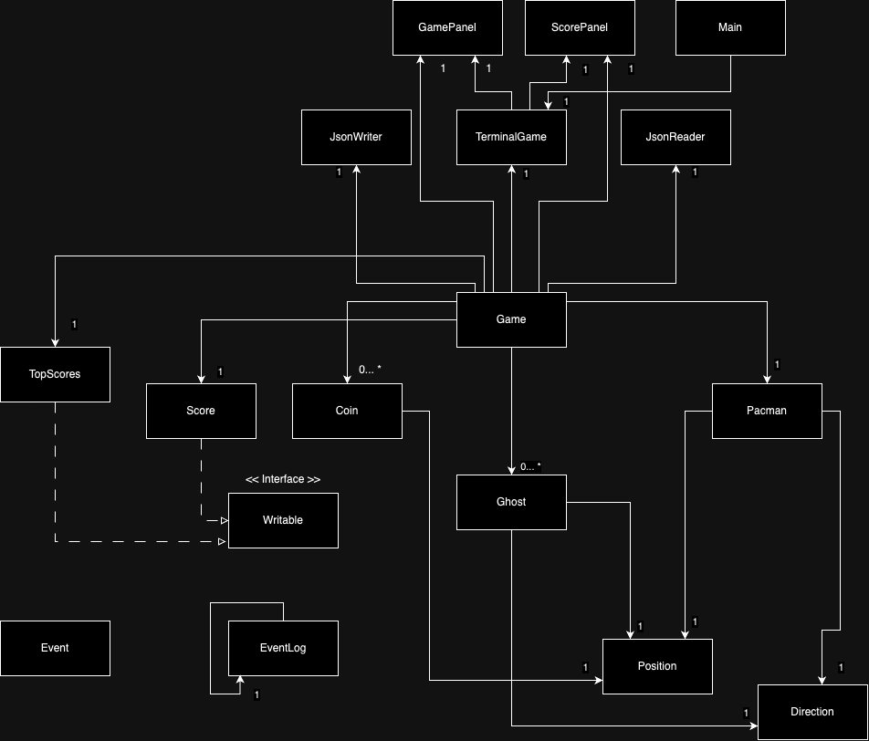

# **Pacman in Java!**

## *What will the application do?*
This application will utilize the Java programming language and the GUI framework Java Swing to recreate the popular arcade game Pacman! The game features the basic rules of Pacman (a yellow ball with a mouth) is trying to eat yellow coins while avoiding the purple "Ghosts" that
will be spawned around the maze-like game board. Obstacles in the form of black walls will be in the maze and if any game piece (Pacman or the Ghosts) hits the ends of the maze or a wall, they will not be able to move and have to redirect to a different side. However, I will be modifying this game so that if Pacman gets hit by a Ghost the game will restart. No power-ups will be offered where Pacman can eat a special coin to
allow him to eat Ghosts a set number of times. The goal of the game is to eat as many coins without the game restarting and for the longest time possible. When all yellow coins are gone, the game restarts and the level increases.
Each level will have all Ghosts have their movement increased by 5 with the number of Ghosts increasing by 2.

To fufil the requirement of the game having no fixed number of game pieces, if the spacebar is clicked, a Ghost will spawn at a set area in the maze to make the game harder. 

## *Who will use it?*
Anyone I know could use it! I plan to eventually move this game into my personal website where people around the world could access the website
and play Pacman. I will play during my spare time and with friends after a long day of work. 

## *Why is this project of interest to me?*
This project is of interest to me because with the industry of game development rising in popularity, I want to gain an 
edge in this career path by seeing how a game is created and to see if this is a path I want to take in the future. 
Additionally, I used to play arcade games in the past and Pacman was my favourite so this will be a nostalgic event for me. 

## *User Stories:*

- As a user, I want to be able to see a World (layout of game - maze) and it's boundaries (walls)
- As a user, I want to press the spacebar to add a new ghost at set position of World: X and Y
- As a user, I want to view the green coins that spawn around the game at the start (done)
- As a user, I want to view Pacman that has a mouth moving up and down and rotates his body to face the correct direction (done)
- As a user, I want all game pieces to move in the boundaries of (right, left, up, down) (done)
- As a user, I want to view Ghosts spawned around the board and move around randomly (done)
- As a user I want to add multiple Ghosts to my ListOfGhost (done)
- As a user I want to add multiple Coins to my ListOfCoins (done)
- As a user I want to add multiple Scores to my TopScores (done)
- As a user, I want the game to quit when Pacman gets hit by a Ghost. (done)
- As a user, I want to save the world state (game characters and layout) in the game (done)
- As a user, I want to have the user option to the state from the file and resume where they left off (done)

Phase 3 
- Ability to Display X's in your Y (pacman, ghost, and coin in game)
- Related Action 1 (Print Top 5 Scores)
- Related Action 2 (Print Highest Score in Top 5 Scores) (Add any number of ghost + coin)
  (add any score to TopScore)
- Saving (JSON scores)
- Loading (JSON scores)
- Visual Component (Pacman Picture)
- Documentation (in files)

Phase 4: Task 2

Phase 4: Task 3

One thing I would refactor in my code is adding an exceptions. The reason for this is that 
most of the methods that had exception handling were written before we had the module of 
what an exception was and I did not have time to change it. Another thing I wanted to implement 
would be a type hierachy with abstract classes and interface. Most of my code relating to each 
character are pretty similar with having each position so by having an interface
it would have reduce the duplicated code. Additionally, I wanted to implement a
maze UI to simulate an actual pacman game instead of having just the functionality. I plan to have
these changes done during winter break as I will have more time.

